These templates provided components that can be used to build a complete build pipeline for Python language projects
using Screwdriver.

# Installing the templates

1. Fork this repository
2. Create a screwdriver job for your forked repository
3. Start the first build, the pipeline will publish the commands and templates to the screwdriver server.

# Using the templates

The following example screwdriver.yaml should work for most Python applications:

```yaml
version: 4
jobs:
    # Validation jobs
    lint_validation:
        template: python-2104/validate_lint
        requires: [~pr, ~commit]
    security_validation:
        template: python-2104/validate_security
        requires: [~pr, ~commit]
    style_validation:
        template: python-2104/validate_style
        requires: [~pr, ~commit]
    test_validation:
        template: python-2104/validate_unittest
        requires: [~pr, ~commit]
    type_validation:
        template: python-2104/validate_type
        requires: [~pr, ~commit]
    doc_validation:
         template: python-2104/documentation
         requires: [~pr]
    package_validation:
        template: python-2104/package_python
        requires: [~pr]

    # Package auto-versioning, this must run before running any jobs that need the package
    # version.  This is specifically needed for all jobs that generate a published package.
    version:
        template: python-2104/version
        requires: [lint_validation, style_validation, type_validation, security_validation, test_validation, doc_validation]

    # Python packaging
    python_package:
        template: python-2104/package_python
        requires: [version]
    
    # Publish documentation to github pages of this repo
    doc_publish:
         template: python-2104/documentation
         requires: [python_package]
```

## Git Commit flow


